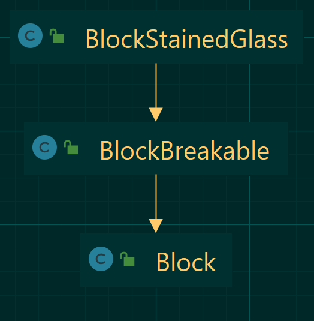

# Technical Details

Break down of the inner workings of Leaf Culling as of 2023-04-18.

## Dependencies

- [FalsePatternLib](https://github.com/FalsePattern/FalsePatternLib): For the mixin plugin extension logic.
- [SpongeMixins](https://github.com/SpongePowered/Mixin): Mixins used for injecting the patches.

## Entry Points

- [Forge Mod](https://github.com/basdxz/LeafCulling/blob/95feaed779b8da52d29b0513e164f164a862d35c/src/main/java/com/github/basdxz/leafculling/LeafCulling.java): Used for initializing some compatibility classes at load time.
- [Mixin Plugin](https://github.com/basdxz/LeafCulling/blob/95feaed779b8da52d29b0513e164f164a862d35c/src/main/java/com/github/basdxz/leafculling/mixin/plugin/MixinPlugin.java): Used for the mixin patches

## Vanilla Behaviour

### Leaf Class Hierarchy


Vanilla leaves all extend `BlockLeaves`, which confusingly is the only class that extends `BlockLeavesBase`. `BlockOldLeaf` is used for Oak, Spruce, Birch and Jungle leaves, while `BlockNewLeaf` is used for Acacia and Big Oak leaves.

### Leaf Metadata


While Minecraft does have 4 bits for it's metadata, allowing for 16 possible states of each block, each leaf block type can only represent 4 distinct variations. This is because half of the four bits are used to represent the leaf decay progress, leaving the remaining for variations.

### Should Side Be Rendered Signature

Minecraft, like many other voxel games, has an optimization to hide internal faces of blocks. When a block is added to the chunk mesh the following method from `Block` is called.

```Java
// As found when using MCP mappings
public boolean shouldSideBeRendered(IBlockAccess p_149646_1_, int p_149646_2_, int p_149646_3_, int p_149646_4_, int p_149646_5_);

// Cleaned up variable names, used in the following examples.
public boolean shouldSideBeRendered(IBlockAccess blockAccess, int otherXPos, int otherYPos, int otherZPos, int side);
```

The method arguments are rather misleading in the provided Forge documentation, so I have corrected them for clarity.

- `IBlockAccess blockAccess`: Generally a `ChunkCache` object, which sources it's data from `WorldClient`
- `int otherXPos, int otherYPos, int otherZPos`: MCP has them documented as `x y z`, but they are meant to be the position of the other block, which this block is being compared against.
- `int side`: This is the side of this block which is being checked, it is also the direction of the block provided in the position.
- `boolean return`: True if the side should render, otherwise false.

### Should Side Be Rendered in Leaves

The implementation in `BlockLeavesBase` will only render the obscured sides if fancy graphics are enabled.


In these two examples, with the first being fancy graphics and the second fast, the red outline shows the geometry of the blocks.

The following code is responsible for deciding weather to render or skip these sides:

```Java
// As found when using MCP mappings
public boolean shouldSideBeRendered(IBlockAccess blockAccess, int otherXPos, int otherYPos, int otherZPos, int side) {
    Block block = blockAccess.getBlock(otherXPos, otherYPos, otherZPos);
    return !this.field_150121_P && block == this ? false : super.shouldSideBeRendered(blockAccess, otherXPos, otherYPos, otherZPos, side);
}

// Cleaned up for clarity.
public boolean shouldSideBeRendered(IBlockAccess blockAccess, int otherXPos, int otherYPos, int otherZPos, int side) {
    // Delegates to the super method, returning false if it does.  
    if (!super.shouldSideBeRendered(blockAccess, otherXPos, otherYPos, otherZPos, side))
        return false;

    // Show the side if fancy graphics are enabled.  
    if (fancyGraphicsEnabled)
        return true;

    // Checking the other block, if it's not the same as this block, show the side.  
    Block otherBlock = blockAccess.getBlock(otherXPos, otherYPos, otherZPos);
    if (otherBlock != this)
        return true;

    // Returning false if the above check fails.  
    return false;
}
```

### Stained Glass Should Side be Rendered



In contrast to the desired behaviour of having leaves act more like stained glass, which inherits it's method from extending `BlockBreakable`.

TODO: SCREENSHOT


Stained glass, which has a special case included in the `BlockBreakable` class, will instead check if the nearby block is another stained glass with the same meta. If this the case, the side will not be rendered.

```Java
// As found when using MCP mappings.
public boolean shouldSideBeRendered(IBlockAccess blockAccess, int otherXPos, int otherYPos, int otherZPos, int side) {
    Block block = blockAccess.getBlock(otherXPos, otherYPos, otherZPos);

    if (this == Blocks.glass || this == Blocks.stained_glass) {
        if (blockAccess.getBlockMetadata(otherXPos, otherYPos, otherZPos) != blockAccess.getBlockMetadata(otherXPos - Facing.offsetsXForSide[side], otherYPos - Facing.offsetsYForSide[side], otherZPos - Facing.offsetsZForSide[side])) {
            return true;
        }

        if (block == this) {
            return false;
        }
    }

    return !this.field_149996_a && block == this ? false : super.shouldSideBeRendered(blockAccess, otherXPos, otherYPos, otherZPos, side);
}

// Cleaned up for clarity.
public boolean shouldSideBeRendered(IBlockAccess blockAccess, int otherXPos, int otherYPos, int otherZPos, int side) {
    // Gets the other block.
    Block otherBlock = blockAccess.getBlock(otherXPos, otherYPos, otherZPos);

    // The special case for glass blocks.
    if (this == Blocks.glass || this == Blocks.stained_glass) {
        // Fetches the metadata of this and the adjacent block.
        int thisBlockMetadata = blockAccess.getBlockMetadata(otherXPos - Facing.offsetsXForSide[side],
                                                             otherYPos - Facing.offsetsYForSide[side],
                                                             otherZPos - Facing.offsetsZForSide[side]);
        int otherBlockMetadata = blockAccess.getBlockMetadata(otherXPos, otherYPos, otherZPos);

        // If the metadata doesn't match, render the side.
        if (thisBlockM etadata != otherBlockMetadata)
            return true;

        // If the block is equal to this block (in this case, both meta and object) render it.
        if (otherBlock == this)
            return false;

        // If these blocks are the exact same and hide internal sides is false, skip rendering this block.
        // As a note, the `showInternalSides` variable is always false in Vanilla.
        if (otherBlock == this && !showInternalSides)
            return false;
    }

    // Finally, fallback on the super method.
    return super.shouldSideBeRendered(blockAccess, otherXPos, otherYPos, otherZPos, side);
}
```

## Implemented Solution

### Resulting Visuals


[](http://www.youtube.com/watch?v=AWxp2vOyoHY)

With the implemented solution, the visuals produce the desired effect as seen above. With proper handling of decaying leaves.

### Mixin Injection

The first part of this implementation is an injection into the [BlockLeavesBase.class](https://github.com/basdxz/LeafCulling/blob/95feaed779b8da52d29b0513e164f164a862d35c/src/main/java/com/github/basdxz/leafculling/mixin/mixins/client/minecraft/BlockLeavesBaseHideSideAdjacentToEqualMixin.java). Injecting at the start of the `shouldSideBeRendered` method to insert my own check.

The resulting injection looks like this in the `BlockLeavesBase` class:

```Java
public boolean shouldSideBeRendered(IBlockAccess p_149646_1_, int p_149646_2_, int p_149646_3_, int p_149646_4_, int p_149646_5_) {
    CallbackInfoReturnable callbackInfo7 = new CallbackInfoReturnable("shouldSideBeRendered", true);
    this.handler$zzd000$hideSidesAdjacentToEqualBlock(p_149646_1_, p_149646_2_, p_149646_3_, p_149646_4_, p_149646_5_, callbackInfo7);
    if (callbackInfo7.isCancelled()) {
        return callbackInfo7.getReturnValueZ();
    } else {
        Block block = p_149646_1_.getBlock(p_149646_2_, p_149646_3_, p_149646_4_);
        return !this.field_150121_P && block == this ? false : super.shouldSideBeRendered(p_149646_1_, p_149646_2_, p_149646_3_, p_149646_4_, p_149646_5_);
    }
}

private void handler$zzd000$hideSidesAdjacentToEqualBlock(IBlockAccess blockAccess, int otherXPos, int otherYPos, int otherZPos, int side, CallbackInfoReturnable<Boolean> cir) {
    LeafCulling.handleHidingSidesAdjacentEqualLeaves(blockAccess, otherXPos, otherYPos, otherZPos, side, cir);
}
```

### New Should Side be Rendered Check

The injection delegates across to a method in the [LeafCulling.class](https://github.com/basdxz/LeafCulling/blob/95feaed779b8da52d29b0513e164f164a862d35c/src/main/java/com/github/basdxz/leafculling/LeafCulling.java#L28), which performs much the same checks as the stained glass. Comparing this block to the other block, including the metadata, with the only difference being that the two most significant bits of the leaves, which are used to represent the decay, are masked off.

## Mod compatibility

### Explicitly Patched Mods

A list of patches for the supported mods can be found in the [Mixin.class](https://github.com/basdxz/LeafCulling/blob/95feaed779b8da52d29b0513e164f164a862d35c/src/main/java/com/github/basdxz/leafculling/mixin/plugin/Mixin.java).

Provided here for convenience:

- Chisel
- Biomes O' Plenty
- Forestry
- Minefactory Reloaded
- Aether (1 and 2)
- Tinkers Construct
- Thaumcraft
- Ancient Trees

Additional mod support will be added on request.

### Why are Patches Needed?

While many mods will work out of the box, some require explicit patches. This can happen for a number of common reasons:

Replacing the `shouldSideBeRendered` method to always return `true`, such as in Biomes 'O Plenty's `BlockBOPLeaves` class:

```Java
public boolean shouldSideBeRendered(IBlockAccess world,int x,int y,int z,int side){
    return true;
}
```

Copying the method from `shouldSideBeRendered` unchanged, such as in Thaumcraft's `BlockMagicalLeaves` class:

```Java
public boolean shouldSideBeRendered(IBlockAccess par1IBlockAccess, int par2, int par3, int par4, int par5) {
    Block var6 = par1IBlockAccess.getBlock(par2, par3, par4);
    return Blocks.leaves.isOpaqueCube() && var6 == this ? false : super.shouldSideBeRendered(par1IBlockAccess, par2, par3, par4, par5);
}
```

Not extending the `BlockLeaves` or `BlockLeavesBase` class, such as in Chisel's `BlockLeaf` class:


In these scenarios, a custom compatibility patch is needed.

## Tinkers Construct Ore Berries Patch


The Tinkers Construct ore berry bush is an interesting edge case. For a start, it is odd for it to extend `BlockLeavesBase` considering how different it is from the general leaf block. Secondly, the size changes as it grows, requiring a bit of extra logic for it to work correctly.

The implemented solution can be found in the [ModCompat.class](https://github.com/basdxz/LeafCulling/blob/95feaed779b8da52d29b0513e164f164a862d35c/src/main/java/com/github/basdxz/leafculling/ModCompat.java). Where if Tinkers Construct is present, the extra check can be performed. It is a naive implementation, but it works well here.

It restricts the side culling by two criteria, the bushes must be the same ore bush by variation and they must both be max sided.

## Future Improvements

In the next iteration of Leaf Culling, I would like to move away from the individual Mixin-based approach to a more general global-ASM based approach, adding only extra logic for edge cases such as the berry bushes or other edge-cases that may pop up.

I would also like to have an in-game method of including additional leaves, storing them as a config. Perhaps even shipping with a decent pre-made configuration file for any outliers.

[Cull Leaves](https://www.curseforge.com/minecraft/mc-mods/cull-leaves) mod along side the [Better Leaves](https://) resourcepack, both made by [Motschen](https://legacy.curseforge.com/members/Motschen/projects), provide a better visual experience in Minecraft versions 1.13 and up. In part from hiding only the backside of the leaves if they are deep enough into the tree. Including equivalent functionallity is also planned.
